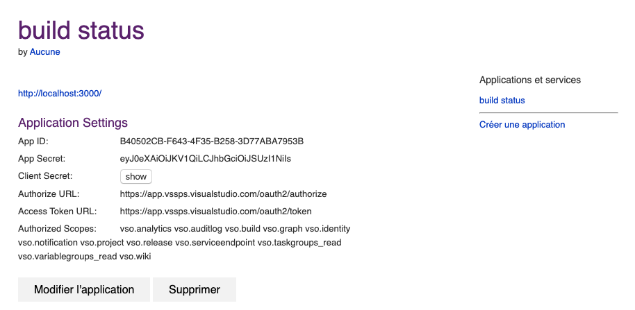

# Ce qui est demandé

## Authentification

Dans un premier temps, ce que l'on vous demande, c'est d'authentifier votre utilisateur avec son compte Azure Devops et y afficher la photo de son profil.

Il s'agit surtout d'un prérequis à tout le reste.

La documentation est disponible [ici](https://docs.microsoft.com/fr-fr/azure/devops/integrate/get-started/authentication/oauth?view=azure-devops) et [là](https://docs.microsoft.com/fr-fr/rest/api/azure/devops/graph/avatars/get?view=azure-devops-rest-5.1).

En gros, voici comment se déroule l'authentification avec votre MicrosoftID :


La toute première chose à faire, avant même de commencer à poser les mains dans le code, c'est d'[enregistrer votre application](https://app.vsaex.visualstudio.com/app/register).
Voici un exemple :



### URLs à appeler

#### Demande d'autorisation

```url
https://app.vssps.visualstudio.com/oauth2/authorize
        ?client_id={app ID}
        &response_type=Assertion
        &state=token
        &scope={scope}
        &redirect_uri={callback URL}
```

- client_id(GUID): The ID assigned to your app when it was registered
- response_type(string): Assertion
- state(string): Peut avoir n'importe quelle valeur. Typiquement, une valeur de chaîne générée qui - corrèle le rappel avec sa demande d'autorisation associée. Ici, nous mettrons token
- scope(string): Scopes enregistrés avec l'application, iuls doivent être séparés par un espace et la liste est disponible avec votre enregistrement d'app.
  Dans notre exemple, nous avons: `vso.analytics vso.auditlog vso.build vso.graph vso.identity vso.notification vso.project vso.release vso.serviceendpoint vso.taskgroups_read vso.variablegroups_read vso.wiki`
- redirect_uri(URL): URL de callback de votre app. Doit être la même que celle enregistrée.

#### Récupérer ou rafraichir le token

```url
POST: https://app.vssps.visualstudio.com/oauth2/token
```

Headers:

- Content-Type: application/x-www-form-urlencoded

Body :

```url
client_assertion_type=urn:ietf:params:oauth:client-assertion-type:jwt-bearer&client_assertion={0}&grant_type=urn:ietf:params:oauth:grant-type:jwt-bearer&assertion={1}&redirect_uri={2}
```

Remplacer les paramètres par :

- **{0}**: Le `Client secret` fourni lors de l'enregistrement de votre app
- **{1}**: Le paramètre `code` récupéré de votre url (ou du retour de demande d'autorisation)
- **{2}**: URL de callback configuré avec votre application

Une fois le token récupéré, il nous faut l'utiliser dans tous nos appels à l'API Azure Devops en y ajoutant aux headers :

```url
Authorization: Bearer {access_token}
```

#### Avatar

Pour accéder à l'avatar, il vous faut d'abord récupérer vos informations de profile via cet appel :

```url
https://vssps.dev.azure.com/axafrance/_apis/profile/profiles/me
```

Vous obtiendrez une réponse du style :

```json
{
  "displayName": "NOM Prenom",
  "publicAlias": "id-ou-url-publique",
  "emailAddress": "email@domaine.fr",
  "coreRevision": 999999999,
  "timeStamp": "2018-11-17T20:37:19.3254788+00:00",
  "id": "guid-id",
  "revision": 999999999
}
```

Il vous suffit de récupérer l'`id` plus haut et de lancer l'appel suivant :

```url
https://vssps.dev.azure.com/{domaine}/_apis/graph/descriptors/{id}
```

avec pour réponse :

```json
{
  "value": "aad.MGU3MGRiYTItMTExNC03YmZhLTg0MmEtZTVkY2M3YzI0OTcz",
  "_links": {
    "self": {
      "href": "https://vssps.dev.azure.com/mondomaine/_apis/Graph/Descriptors/b916eda1-3955-4c10-b243-893720dd7ff9"
    },
    "storageKey": {
      "href": "https://vssps.dev.azure.com/mondomaine/_apis/Graph/StorageKeys/aad.MGU3MGRiYTItMTExNC03YmZhLTg0MmEtZTVkY2M3YzI0OTcz"
    },
    "subject": {
      "href": "https://vssps.dev.azure.com/mondomaine/_apis/Graph/Users/aad.MGU3MGRiYTItMTExNC03YmZhLTg0MmEtZTVkY2M3YzI0OTcz"
    }
  }
}
```

Vous avez donc, enfin, de quoi afficher votre logo via cette url:

```url
https://vssps.dev.azure.com/{domaine}/_apis/graph/Subjects/{subject}/avatars?size={size}&format=png
```

- domaine: Le domaine de votre entreprise (exemple avec mon-domaine: `https://dev.azure.com/mon-domaine/mon-projet`)
- subject: Il vous suffit de reprendre le `value` récupéré précédemment
- size: taille de l'image voulue (3 valeurs possibles : large, medium et small)

### Scenarios

```feature
Feature: Authentification
    Avant même de pouvoir accéder à l'accueil du site,
    Je veux me connecter.

    Scenario: Demande d'autorisation
        When J'arrive sur le site
        Then Une demande d'autorisation est bien faite à 'https://app.vssps.visualstudio.com/oauth2/authorize'
        And les paramètres de la demande d'autorisation sont
            | nom           | valeur                                                                                                                                                                        |
            | client_id     | B40502CB-F643-4F35-B258-3D77ABA7953B                                                                                                                                          |
            | response_type | Assertion                                                                                                                                                                     |
            | state         | token                                                                                                                                                                         |
            | scope         | vso.analytics vso.auditlog vso.build vso.graph vso.identity vso.notification vso.project vso.release vso.serviceendpoint vso.taskgroups_read vso.variablegroups_read vso.wiki |
            | redirect_uri  | http://localhost:3000                                                                                                                                                         |

    Scenario: Affichage du logo
        Given Je suis connecté avec le compte 'utilisateur@microsoft.com'
        When J'arrive sur la page d'accueil
        Then La récupération de mon avatar s'est faite avec le token 'tok3n' qui a retourné l'url 'https://vssps.dev.azure.com/mondomaine/_apis/graph/Subjects/aad.MGU3MGRiYTItMTExNC03YmZhLTg0MmEtZTVkY2M3YzI0OTcz/avatars?size=medium&format=png'
```

Il manque beaucoup de cas et de détails que vous pourrez régler via des tests unitaires ou d'autres scenarios de votre cru (pour les cas d'erreurs, par exemple).

## Projets et définitions de build

La deuxième étape consiste à utiliser ce que nous venons d'implémenter pour récupérer la liste des projets auquels l'utilisateur à accès regroupés par domaine qu'il aura renseigné au préalable.

Vous pouvez récupérer la liste des domaines accessible pour le compte sélectionné via :

```url
https://app.vssps.visualstudio.com/_apis/accounts?memberId={idProfile}
```
